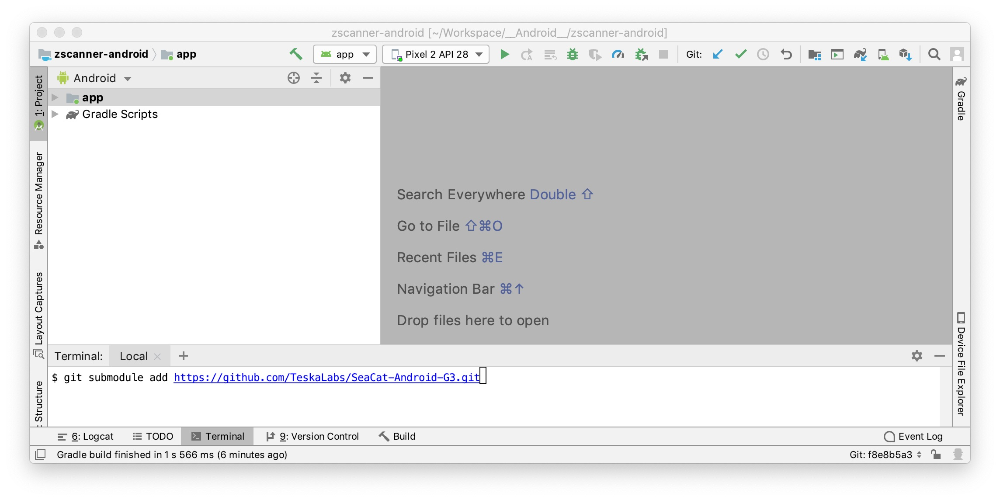
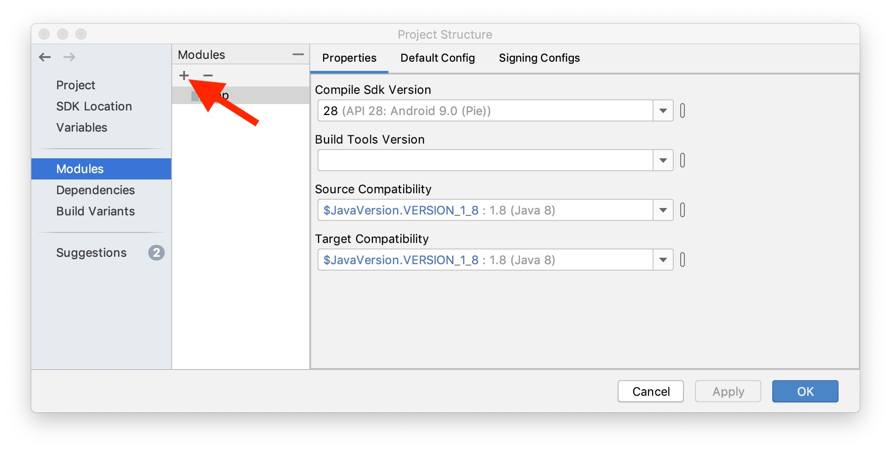
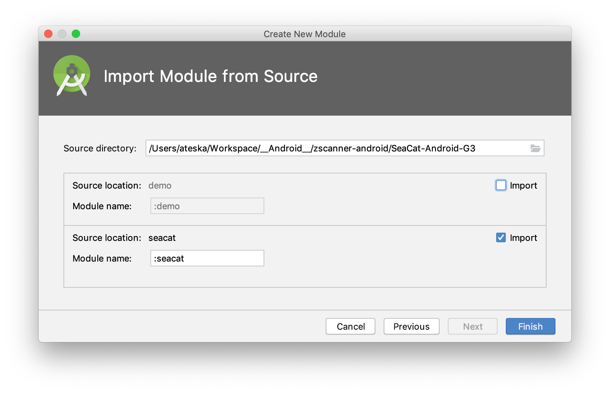
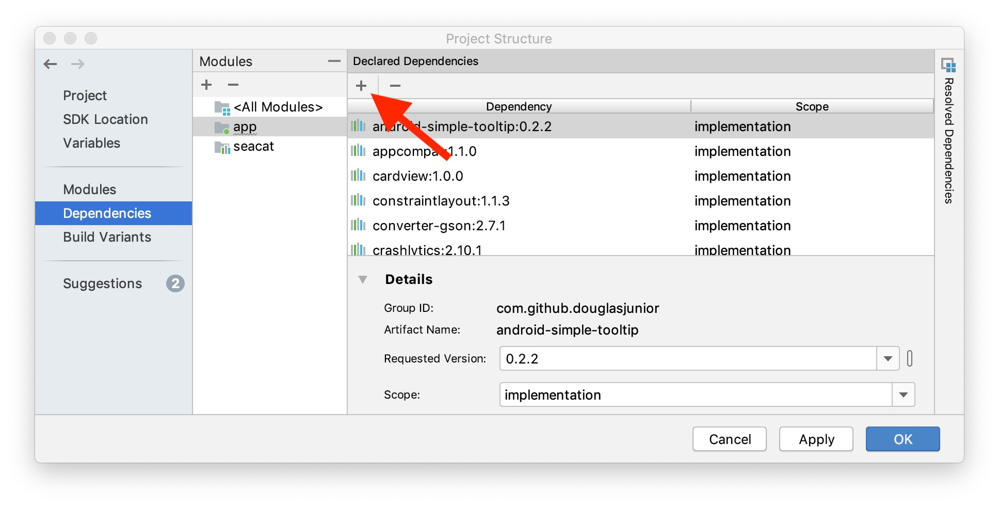
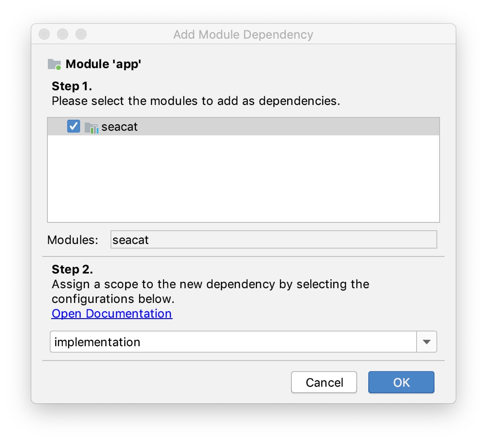

# SeaCat SDK for Android

The 3rd generation of a SeaCat client for Android.

## Installation from [GitHub](https://github.com/TeskaLabs/SeaCat-Android-G3)

The installation procedure has been inspired by [this blog article](https://medium.com/@deepakpk/how-to-add-a-git-android-library-project-as-a-sub-module-c713a653ab1f).
We assume that your Android project is managed by Git version control system.

1. From _Android Studio_ project terminal add git sub-module

		git submodule add https://github.com/TeskaLabs/SeaCat-Android-G3.git

   

2. Open _Android Studio_ > File menu > Project Structure...
3. Go to "Modules" and hit "+" (aka New Module)

   

4. Select "Import Gradle Project"
5. Select "Source directory", it is "SeaCat-Android-G3" folder in your project.
6. Unselect "demo" checkbox.

   

7. Press "Finish".
8. Wait for Gradle to finish.
9. Stay in "Project Structure" dialog, go to "Dependencies". select your application and "+" (aka Add Dependency)

   

10. Select "Module Dependency"
11. Select "seacat" and press "OK"

   

12. Press "OK" to close "Project Structure" dialog.
13. The SeaCat client has been added to your project, please continue to a "Quick start" chapter.


## Quick start

1. SeaCat client needs to be initialized in your application class.

	Kotlin:

	```
	...
	import com.teskalabs.seacat.SeaCat
	...
	
	class MyApplication : Application() {
	
		...
		lateinit var seacat: SeaCat
		...

		override fun onCreate() {
			...
			seacat = SeaCat(this, "<URL of your SeaCat PKI>")
			...
		}
	}
	```
